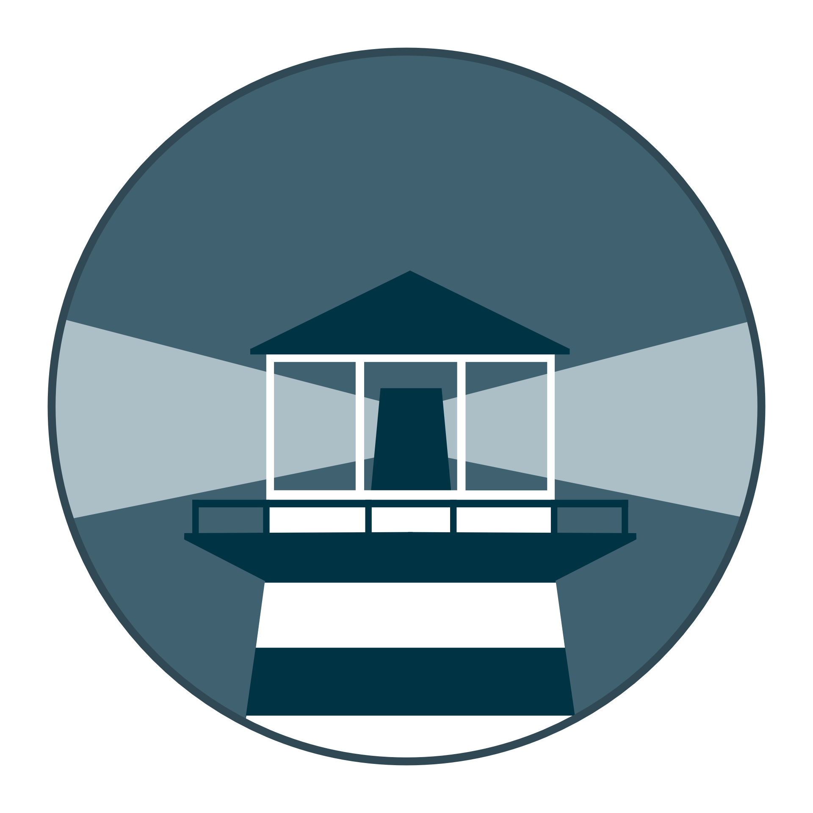

<div align="center">
  
  
  # Watchtower
  
  A process for automating Docker container base image updates.
  <br/><br/>
  
  [](https://circleci.com/gh/containrrr/watchtower)
  [](https://codecov.io/gh/containrrr/watchtower)
  [](https://godoc.org/github.com/containrrr/watchtower)
  [](https://goreportcard.com/report/github.com/containrrr/watchtower)
  [](https://github.com/containrrr/watchtower/releases)
  [](https://www.apache.org/licenses/LICENSE-2.0)
  [](https://www.codacy.com/gh/containrrr/watchtower/dashboard?utm_source=github.com&amp;utm_medium=referral&amp;utm_content=containrrr/watchtower&amp;utm_campaign=Badge_Grade)
  [](#contributors)
  [](https://hub.docker.com/r/containrrr/watchtower)

</div>

## Quick Start

With watchtower you can update the running version of your containerized app simply by pushing a new image to the Docker Hub or your own image registry. 

Watchtower will pull down your new image, gracefully shut down your existing container and restart it with the same options that were used when it was deployed initially. Run the watchtower container with the following command:

```
$ docker run --detach \
    --name watchtower \
    --volume /var/run/docker.sock:/var/run/docker.sock \
    containrrr/watchtower
```

Watchtower is intended to be used in homelabs, media centers, local dev environments, and similar. We do **not** recommend using Watchtower in a commercial or production environment. If that is you, you should be looking into using Kubernetes. If that feels like too big a step for you, please look into solutions like [MicroK8s](https://microk8s.io/) and [k3s](https://k3s.io/) that take away a lot of the toil of running a Kubernetes cluster. 

## Documentation
The full documentation is available at https://containrrr.dev/watchtower.

## Contributors

Thanks goes to these wonderful people ([emoji key](https://allcontributors.org/docs/en/emoji-key)):

<!-- ALL-CONTRIBUTORS-LIST:START - Do not remove or modify this section -->
<!-- prettier-ignore-start -->
<!-- markdownlint-disable -->
<table>
  <tbody>
    <tr>
      <td align="center" valign="top" width="14.28%"><a href="https://piksel.se"><br /><sub><b>nils måsén</b></sub></a><br /><a href="https://github.com/containrrr/watchtower/commits?author=piksel" title="Code">💻</a> <a href="https://github.com/containrrr/watchtower/commits?author=piksel" title="Documentation">📖</a> <a href="#maintenance-piksel" title="Maintenance">🚧</a> <a href="https://github.com/containrrr/watchtower/pulls?q=is%3Apr+reviewed-by%3Apiksel" title="Reviewed Pull Requests">👀</a></td>
      <td align="center" valign="top" width="14.28%"><a href="http://simme.dev"><br /><sub><b>Simon Aronsson</b></sub></a><br /><a href="https://github.com/containrrr/watchtower/commits?author=simskij" title="Code">💻</a> <a href="https://github.com/containrrr/watchtower/commits?author=simskij" title="Documentation">📖</a> <a href="#maintenance-simskij" title="Maintenance">🚧</a> <a href="https://github.com/containrrr/watchtower/pulls?q=is%3Apr+reviewed-by%3Asimskij" title="Reviewed Pull Requests">👀</a></td>
      <td align="center" valign="top" width="14.28%"><a href="http://codelica.com"><br /><sub><b>James</b></sub></a><br /><a href="https://github.com/containrrr/watchtower/commits?author=Codelica" title="Tests">⚠️</a> <a href="#ideas-Codelica" title="Ideas, Planning, & Feedback">🤔</a></td>
      <td align="center" valign="top" width="14.28%"><a href="https://kopfkrieg.org"><br /><sub><b>Florian</b></sub></a><br /><a href="https://github.com/containrrr/watchtower/pulls?q=is%3Apr+reviewed-by%3AKopfKrieg" title="Reviewed Pull Requests">👀</a> <a href="https://github.com/containrrr/watchtower/commits?author=KopfKrieg" title="Documentation">📖</a></td>
      <td align="center" valign="top" width="14.28%"><a href="https://github.com/bdehamer"><br /><sub><b>Brian DeHamer</b></sub></a><br /><a href="https://github.com/containrrr/watchtower/commits?author=bdehamer" title="Code">💻</a> <a href="#maintenance-bdehamer" title="Maintenance">🚧</a></td>
      <td align="center" valign="top" width="14.28%"><a href="https://github.com/rosscado"><br /><sub><b>Ross Cadogan</b></sub></a><br /><a href="https://github.com/containrrr/watchtower/commits?author=rosscado" title="Code">💻</a></td>
      <td align="center" valign="top" width="14.28%"><a href="https://github.com/stffabi"><br /><sub><b>stffabi</b></sub></a><br /><a href="https://github.com/containrrr/watchtower/commits?author=stffabi" title="Code">💻</a> <a href="#maintenance-stffabi" title="Maintenance">🚧</a></td>
    </tr>
    <tr>
      <td align="center" valign="top" width="14.28%"><a href="https://github.com/ATCUSA"><br /><sub><b>Austin</b></sub></a><br /><a href="https://github.com/containrrr/watchtower/commits?author=ATCUSA" title="Documentation">📖</a></td>
      <td align="center" valign="top" width="14.28%"><a href="https://labs.ctl.io"><br /><sub><b>David Gardner</b></sub></a><br /><a href="https://github.com/containrrr/watchtower/pulls?q=is%3Apr+reviewed-by%3Adavidgardner11" title="Reviewed Pull Requests">👀</a> <a href="https://github.com/containrrr/watchtower/commits?author=davidgardner11" title="Documentation">📖</a></td>
      <td align="center" valign="top" width="14.28%"><a href="https://github.com/dolanor"><br /><sub><b>Tanguy ⧓ Herrmann</b></sub></a><br /><a href="https://github.com/containrrr/watchtower/commits?author=dolanor" title="Code">💻</a></td>
      <td align="center" valign="top" width="14.28%"><a href="https://github.com/rdamazio"><br /><sub><b>Rodrigo Damazio Bovendorp</b></sub></a><br /><a href="https://github.com/containrrr/watchtower/commits?author=rdamazio" title="Code">💻</a> <a href="https://github.com/containrrr/watchtower/commits?author=rdamazio" title="Documentation">📖</a></td>
      <td align="center" valign="top" width="14.28%"><a href="https://www.taisun.io/"><br /><sub><b>Ryan Kuba</b></sub></a><br /><a href="#infra-thelamer" title="Infrastructure (Hosting, Build-Tools, etc)">🚇</a></td>
      <td align="center" valign="top" width="14.28%"><a href="https://github.com/cnrmck"><br /><sub><b>cnrmck</b></sub></a><br /><a href="https://github.com/containrrr/watchtower/commits?author=cnrmck" title="Documentation">📖</a></td>
      <td align="center" valign="top" width="14.28%"><a href="http://harrywalter.co.uk"><br /><sub><b>Harry Walter</b></sub></a><br /><a href="https://github.com/containrrr/watchtower/commits?author=haswalt" title="Code">💻</a></td>
    </tr>
    <tr>
      <td align="center" valign="top" width="14.28%"><a href="http://projectsperanza.com"><br /><sub><b>Robotex</b></sub></a><br /><a href="https://github.com/containrrr/watchtower/commits?author=Robotex" title="Documentation">📖</a></td>
      <td align="center" valign="top" width="14.28%"><a href="http://geraldpape.io"><br /><sub><b>Gerald Pape</b></sub></a><br /><a href="https://github.com/containrrr/watchtower/commits?author=ubergesundheit" title="Documentation">📖</a></td>
      <td align="center" valign="top" width="14.28%"><a href="https://github.com/fomk"><br /><sub><b>fomk</b></sub></a><br /><a href="https://github.com/containrrr/watchtower/commits?author=fomk" title="Code">💻</a></td>
      <td align="center" valign="top" width="14.28%"><a href="https://github.com/svengo"><br /><sub><b>Sven Gottwald</b></sub></a><br /><a href="#infra-svengo" title="Infrastructure (Hosting, Build-Tools, etc)">🚇</a></td>
      <td align="center" valign="top" width="14.28%"><a href="https://liberapay.com/techknowlogick/"><br /><sub><b>techknowlogick</b></sub></a><br /><a href="https://github.com/containrrr/watchtower/commits?author=techknowlogick" title="Code">💻</a></td>
      <td align="center" valign="top" width="14.28%"><a href="http://log.c5t.org/about/"><br /><sub><b>waja</b></sub></a><br /><a href="https://github.com/containrrr/watchtower/commits?author=waja" title="Documentation">📖</a></td>
      <td align="center" valign="top" width="14.28%"><a href="http://scottalbertson.com"><br /><sub><b>Scott Albertson</b></sub></a><br /><a href="https://github.com/containrrr/watchtower/commits?author=salbertson" title="Documentation">📖</a></td>
    </tr>
    <tr>
      <td align="center" valign="top" width="14.28%"><a href="https://github.com/huddlesj"><br /><sub><b>Jason Huddleston</b></sub></a><br /><a href="https://github.com/containrrr/watchtower/commits?author=huddlesj" title="Documentation">📖</a></td>
      <td align="center" valign="top" width="14.28%"><a href="https://npstr.space/"><br /><sub><b>Napster</b></sub></a><br /><a href="https://github.com/containrrr/watchtower/commits?author=napstr" title="Code">💻</a></td>
      <td align="center" valign="top" width="14.28%"><a href="https://github.com/darknode"><br /><sub><b>Maxim</b></sub></a><br /><a href="https://github.com/containrrr/watchtower/commits?author=darknode" title="Code">💻</a> <a href="https://github.com/containrrr/watchtower/commits?author=darknode" title="Documentation">📖</a></td>
      <td align="center" valign="top" width="14.28%"><a href="https://schmitt.cat"><br /><sub><b>Max Schmitt</b></sub></a><br /><a href="https://github.com/containrrr/watchtower/commits?author=mxschmitt" title="Documentation">📖</a></td>
      <td align="center" valign="top" width="14.28%"><a href="https://github.com/cron410"><br /><sub><b>cron410</b></sub></a><br /><a href="https://github.com/containrrr/watchtower/commits?author=cron410" title="Documentation">📖</a></td>
      <td align="center" valign="top" width="14.28%"><a href="https://github.com/Cardoso222"><br /><sub><b>Paulo Henrique</b></sub></a><br /><a href="https://github.com/containrrr/watchtower/commits?author=Cardoso222" title="Documentation">📖</a></td>
      <td align="center" valign="top" width="14.28%"><a href="https://coded.io"><br /><sub><b>Kaleb Elwert</b></sub></a><br /><a href="https://github.com/containrrr/watchtower/commits?author=belak" title="Documentation">📖</a></td>
    </tr>
    <tr>
      <td align="center" valign="top" width="14.28%"><a href="https://github.com/wmbutler"><br /><sub><b>Bill Butler</b></sub></a><br /><a href="https://github.com/containrrr/watchtower/commits?author=wmbutler" title="Documentation">📖</a></td>
      <td align="center" valign="top" width="14.28%"><a href="https://www.mariotacke.io"><br /><sub><b>Mario Tacke</b></sub></a><br /><a href="https://github.com/containrrr/watchtower/commits?author=mariotacke" title="Code">💻</a></td>
      <td align="center" valign="top" width="14.28%"><a href="https://markwoodbridge.com"><br /><sub><b>Mark Woodbridge</b></sub></a><br /><a href="https://github.com/containrrr/watchtower/commits?author=mrw34" title="Code">💻</a></td>
      <td align="center" valign="top" width="14.28%"><a href="https://github.com/Ansem93"><br /><sub><b>Ansem93</b></sub></a><br /><a href="https://github.com/containrrr/watchtower/commits?author=Ansem93" title="Documentation">📖</a></td>
      <td align="center" valign="top" width="14.28%"><a href="https://github.com/lukapeschke"><br /><sub><b>Luka Peschke</b></sub></a><br /><a href="https://github.com/containrrr/watchtower/commits?author=lukapeschke" title="Code">💻</a> <a href="https://github.com/containrrr/watchtower/commits?author=lukapeschke" title="Documentation">📖</a></td>
      <td align="center" valign="top" width="14.28%"><a href="https://github.com/zoispag"><br /><sub><b>Zois Pagoulatos</b></sub></a><br /><a href="https://github.com/containrrr/watchtower/commits?author=zoispag" title="Code">💻</a> <a href="https://github.com/containrrr/watchtower/pulls?q=is%3Apr+reviewed-by%3Azoispag" title="Reviewed Pull Requests">👀</a> <a href="#maintenance-zoispag" title="Maintenance">🚧</a></td>
      <td align="center" valign="top" width="14.28%"><a href="https://alexandre.menif.name"><br /><sub><b>Alexandre Menif</b></sub></a><br /><a href="https://github.com/containrrr/watchtower/commits?author=alexandremenif" title="Code">💻</a></td>
    </tr>
    <tr>
      <td align="center" valign="top" width="14.28%"><a href="https://github.com/chugunov"><br /><sub><b>Andrey</b></sub></a><br /><a href="https://github.com/containrrr/watchtower/commits?author=chugunov" title="Documentation">📖</a></td>
      <td align="center" valign="top" width="14.28%"><a href="https://noplanman.ch"><br /><sub><b>Armando Lüscher</b></sub></a><br /><a href="https://github.com/containrrr/watchtower/commits?author=noplanman" title="Documentation">📖</a></td>
      <td align="center" valign="top" width="14.28%"><a href="https://github.com/rjbudke"><br /><sub><b>Ryan Budke</b></sub></a><br /><a href="https://github.com/containrrr/watchtower/commits?author=rjbudke" title="Documentation">📖</a></td>
      <td align="center" valign="top" width="14.28%"><a href="http://kaloyan.raev.name"><br /><sub><b>Kaloyan Raev</b></sub></a><br /><a href="https://github.com/containrrr/watchtower/commits?author=kaloyan-raev" title="Code">💻</a> <a href="https://github.com/containrrr/watchtower/commits?author=kaloyan-raev" title="Tests">⚠️</a></td>
      <td align="center" valign="top" width="14.28%"><a href="https://github.com/sixth"><br /><sub><b>sixth</b></sub></a><br /><a href="https://github.com/containrrr/watchtower/commits?author=sixth" title="Documentation">📖</a></td>
      <td align="center" valign="top" width="14.28%"><a href="https://foosel.net"><br /><sub><b>Gina Häußge</b></sub></a><br /><a href="https://github.com/containrrr/watchtower/commits?author=foosel" title="Code">💻</a></td>
      <td align="center" valign="top" width="14.28%"><a href="https://github.com/8ear"><br /><sub><b>Max H.</b></sub></a><br /><a href="https://github.com/containrrr/watchtower/commits?author=8ear" title="Code">💻</a></td>
    </tr>
    <tr>
      <td align="center" valign="top" width="14.28%"><a href="https://pjknkda.github.io"><br /><sub><b>Jungkook Park</b></sub></a><br /><a href="https://github.com/containrrr/watchtower/commits?author=pjknkda" title="Documentation">📖</a></td>
      <td align="center" valign="top" width="14.28%"><a href="https://achfrag.net"><br /><sub><b>Jan Kristof Nidzwetzki</b></sub></a><br /><a href="https://github.com/containrrr/watchtower/commits?author=jnidzwetzki" title="Documentation">📖</a></td>
      <td align="center" valign="top" width="14.28%"><a href="https://www.lukaselsner.de"><br /><sub><b>lukas</b></sub></a><br /><a href="https://github.com/containrrr/watchtower/commits?author=mindrunner" title="Code">💻</a></td>
      <td align="center" valign="top" width="14.28%"><a href="https://codingcoffee.dev"><br /><sub><b>Ameya Shenoy</b></sub></a><br /><a href="https://github.com/containrrr/watchtower/commits?author=codingCoffee" title="Code">💻</a></td>
      <td align="center" valign="top" width="14.28%"><a href="https://github.com/raymondelooff"><br /><sub><b>Raymon de Looff</b></sub></a><br /><a href="https://github.com/containrrr/watchtower/commits?author=raymondelooff" title="Code">💻</a></td>
      <td align="center" valign="top" width="14.28%"><a href="http://codemonkeylabs.com"><br /><sub><b>John Clayton</b></sub></a><br /><a href="https://github.com/containrrr/watchtower/commits?author=jsclayton" title="Code">💻</a></td>
      <td align="center" valign="top" width="14.28%"><a href="https://github.com/Germs2004"><br /><sub><b>Germs2004</b></sub></a><br /><a href="https://github.com/containrrr/watchtower/commits?author=Germs2004" title="Documentation">📖</a></td>
    </tr>
    <tr>
      <td align="center" valign="top" width="14.28%"><a href="https://github.com/lukwil"><br /><sub><b>Lukas Willburger</b></sub></a><br /><a href="https://github.com/containrrr/watchtower/commits?author=lukwil" title="Code">💻</a></td>
      <td align="center" valign="top" width="14.28%"><a href="https://github.com/auanasgheps"><br /><sub><b>Oliver Cervera</b></sub></a><br /><a href="https://github.com/containrrr/watchtower/commits?author=auanasgheps" title="Documentation">📖</a></td>
      <td align="center" valign="top" width="14.28%"><a href="https://github.com/victorcmoura"><br /><sub><b>Victor Moura</b></sub></a><br /><a href="https://github.com/containrrr/watchtower/commits?author=victorcmoura" title="Tests">⚠️</a> <a href="https://github.com/containrrr/watchtower/commits?author=victorcmoura" title="Code">💻</a> <a href="https://github.com/containrrr/watchtower/commits?author=victorcmoura" title="Documentation">📖</a></td>
      <td align="center" valign="top" width="14.28%"><a href="https://github.com/mbrandau"><br /><sub><b>Maximilian Brandau</b></sub></a><br /><a href="https://github.com/containrrr/watchtower/commits?author=mbrandau" title="Code">💻</a> <a href="https://github.com/containrrr/watchtower/commits?author=mbrandau" title="Tests">⚠️</a></td>
      <td align="center" valign="top" width="14.28%"><a href="https://github.com/aneisch"><br /><sub><b>Andrew</b></sub></a><br /><a href="https://github.com/containrrr/watchtower/commits?author=aneisch" title="Documentation">📖</a></td>
      <td align="center" valign="top" width="14.28%"><a href="https://github.com/sixcorners"><br /><sub><b>sixcorners</b></sub></a><br /><a href="https://github.com/containrrr/watchtower/commits?author=sixcorners" title="Documentation">📖</a></td>
      <td align="center" valign="top" width="14.28%"><a href="https://arnested.dk"><br /><sub><b>Arne Jørgensen</b></sub></a><br /><a href="https://github.com/containrrr/watchtower/commits?author=arnested" title="Tests">⚠️</a> <a href="https://github.com/containrrr/watchtower/pulls?q=is%3Apr+reviewed-by%3Aarnested" title="Reviewed Pull Requests">👀</a></td>
    </tr>
    <tr>
      <td align="center" valign="top" width="14.28%"><a href="https://github.com/patski123"><br /><sub><b>PatSki123</b></sub></a><br /><a href="https://github.com/containrrr/watchtower/commits?author=patski123" title="Documentation">📖</a></td>
      <td align="center" valign="top" width="14.28%"><a href="https://rubyroidlabs.com/"><br /><sub><b>Valentine Zavadsky</b></sub></a><br /><a href="https://github.com/containrrr/watchtower/commits?author=Saicheg" title="Code">💻</a> <a href="https://github.com/containrrr/watchtower/commits?author=Saicheg" title="Documentation">📖</a> <a href="https://github.com/containrrr/watchtower/commits?author=Saicheg" title="Tests">⚠️</a></td>
      <td align="center" valign="top" width="14.28%"><a href="https://github.com/bopoh24"><br /><sub><b>Alexander Voronin</b></sub></a><br /><a href="https://github.com/containrrr/watchtower/commits?author=bopoh24" title="Code">💻</a> <a href="https://github.com/containrrr/watchtower/issues?q=author%3Abopoh24" title="Bug reports">🐛</a></td>
      <td align="center" valign="top" width="14.28%"><a href="http://www.teqneers.de"><br /><sub><b>Oliver Mueller</b></sub></a><br /><a href="https://github.com/containrrr/watchtower/commits?author=ogmueller" title="Documentation">📖</a></td>
      <td align="center" valign="top" width="14.28%"><a href="https://github.com/tammert"><br /><sub><b>Sebastiaan Tammer</b></sub></a><br /><a href="https://github.com/containrrr/watchtower/commits?author=tammert" title="Code">💻</a></td>
      <td align="center" valign="top" width="14.28%"><a href="https://github.com/Miosame"><br /><sub><b>miosame</b></sub></a><br /><a href="https://github.com/containrrr/watchtower/commits?author=miosame" title="Documentation">📖</a></td>
      <td align="center" valign="top" width="14.28%"><a href="https://mtz.gr"><br /><sub><b>Andrew Metzger</b></sub></a><br /><a href="https://github.com/containrrr/watchtower/issues?q=author%3Aandrewjmetzger" title="Bug reports">🐛</a> <a href="#example-andrewjmetzger" title="Examples">💡</a></td>
    </tr>
    <tr>
      <td align="center" valign="top" width="14.28%"><a href="https://github.com/pgrimaud"><br /><sub><b>Pierre Grimaud</b></sub></a><br /><a href="https://github.com/containrrr/watchtower/commits?author=pgrimaud" title="Documentation">📖</a></td>
      <td align="center" valign="top" width="14.28%"><a href="https://github.com/mattdoran"><br /><sub><b>Matt Doran</b></sub></a><br /><a href="https://github.com/containrrr/watchtower/commits?author=mattdoran" title="Documentation">📖</a></td>
      <td align="center" valign="top" width="14.28%"><a href="https://github.com/MihailITPlace"><br /><sub><b>MihailITPlace</b></sub></a><br /><a href="https://github.com/containrrr/watchtower/commits?author=MihailITPlace" title="Code">💻</a></td>
      <td align="center" valign="top" width="14.28%"><a href="https://github.com/bugficks"><br /><sub><b>bugficks</b></sub></a><br /><a href="https://github.com/containrrr/watchtower/commits?author=bugficks" title="Code">💻</a> <a href="https://github.com/containrrr/watchtower/commits?author=bugficks" title="Documentation">📖</a></td>
      <td align="center" valign="top" width="14.28%"><a href="https://github.com/MichaelSp"><br /><sub><b>Michael</b></sub></a><br /><a href="https://github.com/containrrr/watchtower/commits?author=MichaelSp" title="Code">💻</a></td>
      <td align="center" valign="top" width="14.28%"><a href="https://github.com/jokay"><br /><sub><b>D. Domig</b></sub></a><br /><a href="https://github.com/containrrr/watchtower/commits?author=jokay" title="Documentation">📖</a></td>
      <td align="center" valign="top" width="14.28%"><a href="https://maxwells-daemon.io"><br /><sub><b>Ben Osheroff</b></sub></a><br /><a href="https://github.com/containrrr/watchtower/commits?author=osheroff" title="Code">💻</a></td>
    </tr>
    <tr>
      <td align="center" valign="top" width="14.28%"><a href="https://github.com/dhet"><br /><sub><b>David H.</b></sub></a><br /><a href="https://github.com/containrrr/watchtower/commits?author=dhet" title="Code">💻</a></td>
      <td align="center" valign="top" width="14.28%"><a href="http://www.gridgeo.com"><br /><sub><b>Chander Ganesan</b></sub></a><br /><a href="https://github.com/containrrr/watchtower/commits?author=chander" title="Documentation">📖</a></td>
      <td align="center" valign="top" width="14.28%"><a href="https://github.com/yrien30"><br /><sub><b>yrien30</b></sub></a><br /><a href="https://github.com/containrrr/watchtower/commits?author=yrien30" title="Code">💻</a></td>
      <td align="center" valign="top" width="14.28%"><a href="https://github.com/ksurl"><br /><sub><b>ksurl</b></sub></a><br /><a href="https://github.com/containrrr/watchtower/commits?author=ksurl" title="Documentation">📖</a> <a href="https://github.com/containrrr/watchtower/commits?author=ksurl" title="Code">💻</a> <a href="#infra-ksurl" title="Infrastructure (Hosting, Build-Tools, etc)">🚇</a></td>
      <td align="center" valign="top" width="14.28%"><a href="https://github.com/rg9400"><br /><sub><b>rg9400</b></sub></a><br /><a href="https://github.com/containrrr/watchtower/commits?author=rg9400" title="Code">💻</a></td>
      <td align="center" valign="top" width="14.28%"><a href="https://github.com/tkalus"><br /><sub><b>Turtle Kalus</b></sub></a><br /><a href="https://github.com/containrrr/watchtower/commits?author=tkalus" title="Code">💻</a></td>
      <td align="center" valign="top" width="14.28%"><a href="https://github.com/SrihariThalla"><br /><sub><b>Srihari Thalla</b></sub></a><br /><a href="https://github.com/containrrr/watchtower/commits?author=SrihariThalla" title="Documentation">📖</a></td>
    </tr>
    <tr>
      <td align="center" valign="top" width="14.28%"><a href="https://nymous.io"><br /><sub><b>Thomas Gaudin</b></sub></a><br /><a href="https://github.com/containrrr/watchtower/commits?author=nymous" title="Documentation">📖</a></td>
      <td align="center" valign="top" width="14.28%"><a href="https://indigo.re/"><br /><sub><b>hydrargyrum</b></sub></a><br /><a href="https://github.com/containrrr/watchtower/commits?author=hydrargyrum" title="Documentation">📖</a></td>
      <td align="center" valign="top" width="14.28%"><a href="https://reinout.vanrees.org"><br /><sub><b>Reinout van Rees</b></sub></a><br /><a href="https://github.com/containrrr/watchtower/commits?author=reinout" title="Documentation">📖</a></td>
      <td align="center" valign="top" width="14.28%"><a href="https://github.com/DasSkelett"><br /><sub><b>DasSkelett</b></sub></a><br /><a href="https://github.com/containrrr/watchtower/commits?author=DasSkelett" title="Code">💻</a></td>
      <td align="center" valign="top" width="14.28%"><a href="https://github.com/zenjabba"><br /><sub><b>zenjabba</b></sub></a><br /><a href="https://github.com/containrrr/watchtower/commits?author=zenjabba" title="Documentation">📖</a></td>
      <td align="center" valign="top" width="14.28%"><a href="https://quan.io"><br /><sub><b>Dan Quan</b></sub></a><br /><a href="https://github.com/containrrr/watchtower/commits?author=djquan" title="Documentation">📖</a></td>
      <td align="center" valign="top" width="14.28%"><a href="https://github.com/modem7"><br /><sub><b>modem7</b></sub></a><br /><a href="https://github.com/containrrr/watchtower/commits?author=modem7" title="Documentation">📖</a></td>
    </tr>
    <tr>
      <td align="center" valign="top" width="14.28%"><a href="https://github.com/hypnoglow"><br /><sub><b>Igor Zibarev</b></sub></a><br /><a href="https://github.com/containrrr/watchtower/commits?author=hypnoglow" title="Code">💻</a></td>
      <td align="center" valign="top" width="14.28%"><a href="https://github.com/patricegautier"><br /><sub><b>Patrice</b></sub></a><br /><a href="https://github.com/containrrr/watchtower/commits?author=patricegautier" title="Code">💻</a></td>
      <td align="center" valign="top" width="14.28%"><a href="http://jamesw.link/me"><br /><sub><b>James White</b></sub></a><br /><a href="https://github.com/containrrr/watchtower/commits?author=jamesmacwhite" title="Documentation">📖</a></td>
      <td align="center" valign="top" width="14.28%"><a href="https://ko-fi.com/foxite"><br /><sub><b>Dirk Kok</b></sub></a><br /><a href="https://github.com/containrrr/watchtower/commits?author=Foxite" title="Code">💻</a></td>
      <td align="center" valign="top" width="14.28%"><a href="https://github.com/EDIflyer"><br /><sub><b>EDIflyer</b></sub></a><br /><a href="https://github.com/containrrr/watchtower/commits?author=EDIflyer" title="Documentation">📖</a></td>
      <td align="center" valign="top" width="14.28%"><a href="https://github.com/jauderho"><br /><sub><b>Jauder Ho</b></sub></a><br /><a href="https://github.com/containrrr/watchtower/commits?author=jauderho" title="Code">💻</a></td>
      <td align="center" valign="top" width="14.28%"><a href="https://tamal.vercel.app/"><br /><sub><b>Tamal Das </b></sub></a><br /><a href="https://github.com/containrrr/watchtower/commits?author=IAmTamal" title="Documentation">📖</a></td>
    </tr>
    <tr>
      <td align="center" valign="top" width="14.28%"><a href="https://github.com/testwill"><br /><sub><b>guangwu</b></sub></a><br /><a href="https://github.com/containrrr/watchtower/commits?author=testwill" title="Documentation">📖</a></td>
      <td align="center" valign="top" width="14.28%"><a href="http://hub.lol"><br /><sub><b>Florian Hübner</b></sub></a><br /><a href="https://github.com/containrrr/watchtower/commits?author=nothub" title="Documentation">📖</a> <a href="https://github.com/containrrr/watchtower/commits?author=nothub" title="Code">💻</a></td>
      <td align="center"><a href="https://github.com/andriibratanin"><br /><sub><b>Andrii Bratanin</b></sub></a><br /><a href="https://github.com/containrrr/watchtower/commits?author=andriibratanin" title="Documentation">📖</a></td>
    </tr>
  </tbody>
</table>

<!-- markdownlint-restore -->
<!-- prettier-ignore-end -->

<!-- ALL-CONTRIBUTORS-LIST:END -->

This project follows the [all-contributors](https://github.com/all-contributors/all-contributors) specification. Contributions of any kind welcome!
