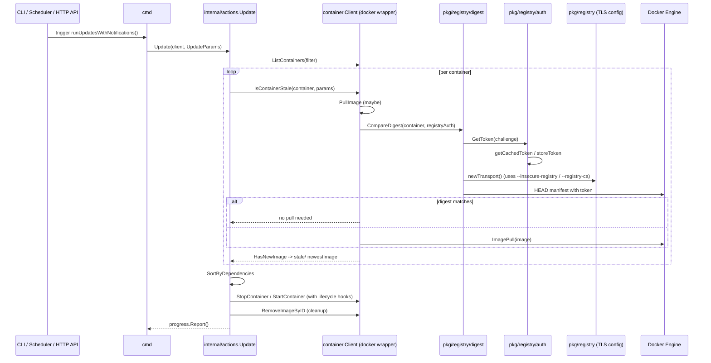

<!--
DO NOT EDIT: Generated documentation describing the Watchtower update flow.
This file contains the end-to-end flow, data shapes, and a mermaid diagram.
-->
# Watchtower Update Flow

This document explains the end-to-end update flow in the Watchtower codebase, including the main function call chain, the key data shapes, and diagrams (Mermaid & PlantUML).

## Quick Summary

- Trigger: CLI (`watchtower` start / scheduler / HTTP API update) constructs `types.UpdateParams` and calls `internal/actions.Update`.
- `internal/actions.Update` orchestrates discovery, stale detection, lifecycle hooks, stopping/restarting containers, cleanup and reporting.
- Image pull optimization uses a digest HEAD request (`pkg/registry/digest`) and a token flow (`pkg/registry/auth`) with an in-memory token cache.
- TLS for HEAD/token requests is secure-by-default and configurable via `--insecure-registry`, `--registry-ca`, and `--registry-ca-validate`.

---

## Call Chain (step-by-step)

1. CLI start / scheduler / HTTP API
   - Entry points: `main()` -> `cmd.Execute()` -> Cobra command `Run` / `PreRun`.
   - `cmd.PreRun` reads flags and config, sets `registry.InsecureSkipVerify` and `registry.RegistryCABundle`.

2. Run update
   - `cmd.runUpdatesWithNotifications` builds `types.UpdateParams` and calls `internal/actions.Update(client, updateParams)`.

3. Orchestration: `internal/actions.Update`
   - If `params.LifecycleHooks` -> `lifecycle.ExecutePreChecks(client, params)`
   - Discover containers: `client.ListContainers(params.Filter)`
   - For each container:
     - `client.IsContainerStale(container, params)`
       - calls `client.PullImage(ctx, container)` unless `container.IsNoPull(params)` is true
         - `PullImage` obtains `types.ImagePullOptions` via `pkg/registry.GetPullOptions(image)`
         - tries digest optimization: `pkg/registry/digest.CompareDigest(container, opts.RegistryAuth)`
           - `auth.GetToken(container, registryAuth)` obtains a token:
             - sends GET to the challenge URL (`/v2/`), inspects `WWW-Authenticate`
             - for `Bearer`: constructs auth URL with `realm`, `service`, and `scope` (`repository:<path>:pull`)
             - checks in-memory cache (`auth.getCachedToken(cacheKey)`) keyed by the auth URL
             - if missing, requests token from auth URL (Basic header if Docker cred present), parses `types.TokenResponse` and calls `auth.storeToken(cacheKey, token, ExpiresIn)`
           - `digest.GetDigest(manifestURL, token)` performs an HTTP `HEAD` using a transport created by `digest.newTransport()`
             - transport respects `registry.InsecureSkipVerify` and uses `registry.GetRegistryCertPool()` when a CA bundle is provided
           - If remote digest matches a local digest, `PullImage` skips the pull
       - `client.HasNewImage(ctx, container)` compares local image ID with remote image ID
     - `targetContainer.VerifyConfiguration()` (fail/skip logic)
     - Mark scanned/skipped in `session.Progress` and set `container.SetStale(stale)`
   - Sort containers: `sorter.SortByDependencies(containers)`
   - `UpdateImplicitRestart(containers)` sets `LinkedToRestarting` flags
   - Build `containersToUpdate` and mark them for update in `Progress`
   - Update strategy:
     - Rolling restart: `performRollingRestart(containersToUpdate, client, params)`
       - `stopStaleContainer(c)` -> `restartStaleContainer(c)` per container
     - Normal: `stopContainersInReversedOrder(...)` -> `restartContainersInSortedOrder(...)`
       - `stopStaleContainer` runs `lifecycle.ExecutePreUpdateCommand` and `client.StopContainer`
       - `restartStaleContainer` may `client.RenameContainer` (watchtower self), `client.StartContainer` and `lifecycle.ExecutePostUpdateCommand`
   - If `params.Cleanup` -> `cleanupImages(client, imageIDs)` calls `client.RemoveImageByID`
   - If `params.LifecycleHooks` -> `lifecycle.ExecutePostChecks(client, params)`
   - Return `progress.Report()` (a `types.Report` implemented from `session.Progress`)

---

## Key data shapes

- `types.UpdateParams` (created in `cmd/runUpdatesWithNotifications`)
  - `Filter` (types.Filter)
  - `Cleanup bool`
  - `NoRestart bool`
  - `Timeout time.Duration`
  - `MonitorOnly bool`
  - `NoPull bool`
  - `LifecycleHooks bool`
  - `RollingRestart bool`
  - `LabelPrecedence bool`

- `container.Client` interface (in `pkg/container/client.go`) — used by `actions.Update`
  - `ListContainers(Filter) ([]types.Container, error)`
  - `GetContainer(containerID) (types.Container, error)`
  - `StopContainer(types.Container, time.Duration) error`
  - `StartContainer(types.Container) (types.ContainerID, error)`
  - `RenameContainer(types.Container, string) error`
  - `IsContainerStale(types.Container, types.UpdateParams) (bool, types.ImageID, error)`
  - `ExecuteCommand(containerID types.ContainerID, command string, timeout int) (SkipUpdate bool, err error)`
  - `RemoveImageByID(types.ImageID) error`
  - `WarnOnHeadPullFailed(types.Container) bool`

- `types.Container` interface (in `pkg/types/container.go`) — methods used include:
  - `ID(), Name(), ImageName(), ImageID(), SafeImageID(), IsRunning(), IsRestarting()`
  - `VerifyConfiguration() error`, `HasImageInfo() bool`, `ImageInfo() *types.ImageInspect`
  - lifecycle hooks: `GetLifecyclePreUpdateCommand(), GetLifecyclePostUpdateCommand(), PreUpdateTimeout(), PostUpdateTimeout()`
  - flags: `IsNoPull(UpdateParams), IsMonitorOnly(UpdateParams), ToRestart(), IsWatchtower()`

- `session.Progress` and `session.ContainerStatus` (reporting)
  - `Progress` is a map `map[types.ContainerID]*ContainerStatus`
  - `ContainerStatus` fields: `containerID, containerName, imageName, oldImage, newImage, error, state`
  - `Progress.Report()` returns a `types.Report` implementation

- `types.TokenResponse` (used by `pkg/registry/auth`) contains `Token string` and `ExpiresIn int` (seconds)

---

## Diagrams

Mermaid sequence diagram (embedded):

For reference, a PlantUML source for the same sequence is available in `docs/diagrams/update-flow.puml`.

---

## Security & operational notes

- TLS: registry HEAD and token requests are secure-by-default. Use `--registry-ca` to add private CAs, and `--registry-ca-validate` to fail fast on bad bundles. Avoid `--insecure-registry` except for testing.
- Token cache: tokens are cached per auth URL (realm+service+scope). Tokens with `ExpiresIn` are cached for that TTL. No persistent or distributed cache is provided.
- Digest HEAD optimization avoids pulls and unnecessary rate consumption when possible. DockerHub/GHCR may rate-limit HEAD or behave differently; the code includes a `WarnOnAPIConsumption` heuristic.

---

## Where to look in the code

- Orchestration: `internal/actions/update.go`
- CLI wiring: `cmd/root.go`, `internal/flags/flags.go`
- Container wrapper: `pkg/container/client.go`, `pkg/container/container.go`
- Digest & transport: `pkg/registry/digest/digest.go`
- Token & auth handling: `pkg/registry/auth/auth.go`
- TLS helpers: `pkg/registry/registry.go`
- Lifecycle hooks: `pkg/lifecycle/lifecycle.go`
- Session/reporting: `pkg/session/*`, `pkg/types/report.go`

---

If you'd like, I can also open a branch and create a PR with these files, or convert the PlantUML into an SVG and add it to the docs site.

End of document.
